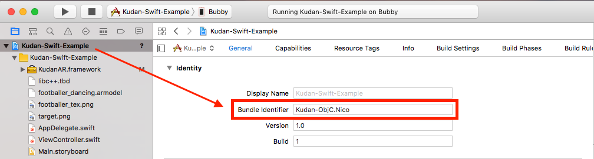
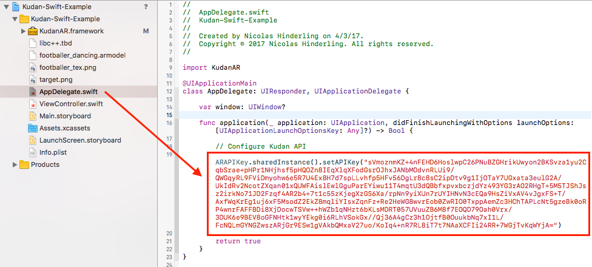
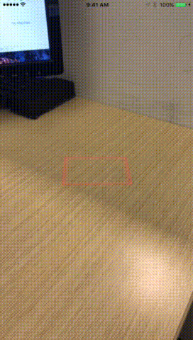

# Kudan-Swift-Markerless-AR-Example
I decided to create this project after struggling to find any examples of Kudan used with Swift. Hopefully this helps someone along the way :raised_hands:

## Build Instructions

1.) Go into the project file and set the bundle identifier to a unique string of whatever you want:

2.) Go to [https://www.kudan.eu/keys/](https://www.kudan.eu/keys/) and get a free API key for your unique bundle ID

3.) Open `AppDelegate.swift` and paste your API key into `.setAPIKey("")` so it looks something like this:

:tada: You're done! Go ahead and try building. It should look something like this:

## Use
When the red square appears, hover it over a surface and tap the screen to place our dancing guy. You can also change his scale and orientation by pinching and panning.
